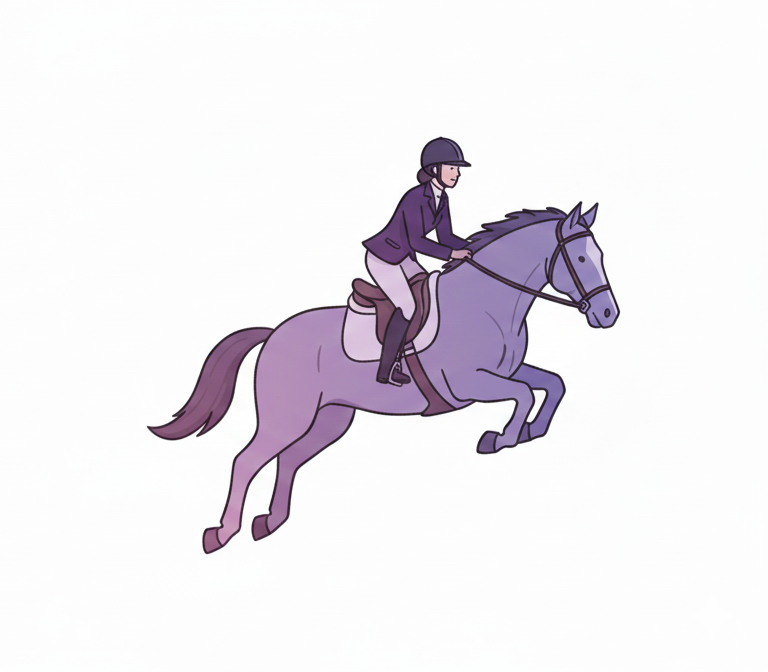
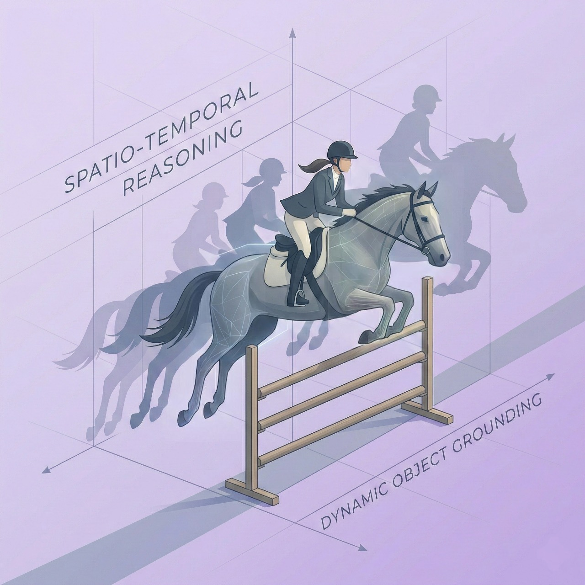

<style>
.author-block {
    text-align: center;
    margin: 30px auto 10px;
    width: 100%;
    line-height: 2;
}

.author-block .authors {
    font-size: 1.15rem;
    color: #333;
}

.author-block .authors a {
    color: #333;
    text-decoration: none;
}

.author-block .authors a:hover {
    color: #1a3a6b;
    text-decoration: underline;
}

.author-block .authors sup {
    font-size: 0.7em;
    color: #888;
    margin: 0 1px;
}

.author-block .affiliations {
    font-size: 1.0rem;
    color: #555;
    margin-top: 8px;
}

.author-block .affiliations sup {
    font-size: 0.7em;
    color: #888;
    margin-right: 1px;
}

.author-block .affiliations .aff-logo {
    height: 1.1em;
    vertical-align: middle;
    margin: 0 2px 0 4px;
}

.author-block .author-notes {
    font-size: 0.92rem;
    color: #999;
    margin-top: 10px;
}

.author-block .author-venue {
    font-size: 1.15rem;
    font-weight: 700;
    color: #888;
    margin-top: 6px;
    letter-spacing: 0.5px;
}

@media (max-width: 768px) {
    .author-block {
        width: 100%;
    }
    .author-block .authors {
        font-size: 1.0rem;
    }
}
</style>

<div align="center" style="font-family: charter;">

<h1>
    
    <i>Thinking in Dynamics</i>:<br/> How Multimodal Large Language Models Perceive, Track, and Reason Dynamics in Physical 4D World
</h1>


<br />

<a href="https://arxiv.org/abs/2512.03000" target="_blank"></a>
<a href="https://dyn-bench.github.io/" target="_blank"></a>
<a href="https://huggingface.co/datasets/yu2hi13/Dyn-Bench" target="_blank"></a>

<div class="author-block">
    <div class="authors">
        Yuzhi Huang<sup>*♠1</sup> &nbsp;
        Kairun Wen<sup>*1</sup> &nbsp;
        Rongxin Gao<sup>*1</sup> &nbsp;
        Dongxuan Liu<sup>1</sup> &nbsp;
        Yibin Lou<sup>3</sup> &nbsp;
        Jie Wu<sup>2</sup> &nbsp;
        Jing Xu<sup>7</sup>
        Jian Zhang<sup>1</sup> &nbsp;
        Zheng Yang<sup>1</sup> &nbsp;
        Yunlong Lin<sup>1</sup> &nbsp;
        Chenxin Li<sup>4</sup> &nbsp;
        Panwang Pan<sup>1</sup> &nbsp;
        Junbin Lu<sup>5</sup> &nbsp;
        Jingyan Jiang<sup>6</sup>
        Xinghao Ding<sup>1</sup> &nbsp;
        Yue Huang<sup>&dagger; 1</sup> &nbsp;
        Zhi Wang<sup>2</sup>
    </div>
    <div class="affiliations">
        <sup>1</sup>XMU  &nbsp;&nbsp;
        <sup>2</sup>THU  &nbsp;&nbsp;
        <sup>3</sup>SUSTech  &nbsp;&nbsp;
        <sup>4</sup>CUHK  &nbsp;&nbsp;
        <sup>5</sup>UW  &nbsp;&nbsp;
        <sup>6</sup>SZTU  &nbsp;&nbsp;
        <sup>7</sup>JNU 
    </div>
    <div class="author-notes">
        <sup>*</sup>Equal Contribution &nbsp;&nbsp;&nbsp; <sup>&dagger;</sup>Corresponding author &nbsp;&nbsp;&nbsp; <span>♠</span>Project lead
    </div>
    <div class="author-venue">
        &#127775; CVPR 2026 &#127775;
    </div>
</div>


<p align="justify"><i>Humans inhabit a physical 4D world where geometric structure and semantic content evolve over time. While current Multimodal Large Language Models (MLLMs) excel in static visual understanding, can they also be adept at "thinking in dynamics" — perceiving, tracking and reasoning about spatio-temporal dynamics in evolving scenes? We introduce <strong>Dyn-Bench</strong>, a large-scale benchmark comprising 1k videos, 7k VQA pairs, and 3k dynamic object grounding pairs, systematically assessing MLLMs' ability to perceive, track, and reason about object motion, scene evolution, and camera motion in the physical 4D world.</i></p>

</div>

## Release

- `2025-XX-XX` 🚀 Dyn-Bench evaluation code and benchmark released.

## Contents

- [Release](#release)
- [Contents](#contents)
- [Dyn-Bench](#dyn-bench)
- [Results](#results)
- [Run Your Own Evaluation](#run-your-own-evaluation)
  - [Benchmark](#benchmark)
  - [Installation](#installation)
  - [Configuration](#configuration)
  - [Evaluation](#evaluation)
- [Model List](#model-list)
- [UniPixel Special Instructions](#unipixel-special-instructions)
- [Acknowledgement](#acknowledgement)
- [Citation](#citation)

## Dyn-Bench

**Overview:** We introduce **Dyn-Bench**, a spatio-temporal dynamics reasoning benchmark built from diverse real-world and synthetic video datasets. Dyn-Bench comprises **1k videos**, **7k visual question answering (VQA) pairs**, and **3k dynamic object grounding pairs**, enabling robust and scalable evaluation of spatio-temporal understanding across three evaluation dimensions.

**Evaluation Dimensions**

| Category | Task Suffix | Description |
|----------|-------------|-------------|
| Camera-Object | `cameraqa`, `cameramask` | Reasoning about object dynamics relative to camera motion |
| Inter-Object | `qa`, `objmask` | Reasoning about interactions and relative dynamics between objects |
| Object-Scene | `sceneqa`, `scenemask` | Reasoning about how objects interact with and evolve within the scene |

**Evaluation Metrics**

- **QA Accuracy**: Answer matching accuracy rate for VQA tasks
- **Mask J&F Score**: Average of segmentation mask IoU (J) and boundary F-measure (F) for grounding tasks

## Results

**Evaluation Setup:** We probe general, spatial, and region-level MLLMs across all three evaluation dimensions, assessing both linguistic (VQA) and visual (mask grounding) dynamics understanding. We find that existing models cannot simultaneously maintain strong performance in both spatio-temporal reasoning and dynamic object grounding, often producing inconsistent interpretations of motion and interaction.

> Note: Conventional prompting strategies (e.g., chain-of-thought or caption-based hints) provide limited improvement, whereas structured integration approaches — including **Mask-Guided Fusion** and **Spatio-Temporal Textual Cognitive Map (ST-TCM)** — significantly enhance MLLMs' dynamics perception and spatio-temporal reasoning in the physical 4D world.

## Run Your Own Evaluation

### Benchmark

Our benchmark is hosted on [HuggingFace](https://huggingface.co/datasets/kairunwen/DynamicVerse). You can access the benchmark data using:

```python
# NOTE: pip install datasets

from datasets import load_dataset
dyn_bench = load_dataset("kairunwen/DynamicVerse")
print(dyn_bench)
```

### Installation

**1. Environment Setup**

```bash
conda create -n bench python=3.11
conda activate bench

# Install PyTorch (choose according to your CUDA version, see https://pytorch.org)

pip install -r requirements.txt

# Install flash-attn (recommended to use pre-compiled wheels)
# For Linux:   https://github.com/Dao-AILab/flash-attention/releases
# For Windows: https://github.com/sdbds/flash-attention-for-windows/releases
```

**2. Clone Repository**

```bash
git clone https://github.com/LilyYang0504/bench.git
cd bench
```

### Configuration

Edit `conf/config.yaml`:

```yaml
datasets:
  repo_name: "Huggingface/DatasetsRepo"
  datasets_path: "path/for/your/datasets/download"

model:
  model_path: "path/to/model"
  model_name: "Huggingface/ModelID"
  download_path: "path/for/your/model/download"
  device: "cuda"
  torch_dtype: "bfloat16"
  use_flash_attn: true
  trust_remote_code: true

task: "all"  # choices: all / qa / mask

evaluation:
  boundary_threshold: 2

result_path: "results"
```

### Evaluation

**Download datasets:**
```bash
python download_datasets.py
```

**Download a single model:**
```bash
python download_model.py --model "Huggingface/ModelID"
```

**Batch model download** (edit `conf/model_list.txt` first):
```bash
python download_model.py --batch
```

**Run evaluation:**
```bash
bash start_eval.sh
```

### Project Structure

```
bench/
├── conf/
│   ├── config.yaml
│   └── model_list.txt
├── utils/
├── thirdparty/
├── download_datasets.py
├── download_model.py
├── eval.py
└── start_eval.sh
```

## Model List

**Models Supporting QA + Mask Tasks**

| Model Family | HuggingFace Model ID |
|--------------|---------------------|
| Sa2VA | `ByteDance/Sa2VA-{x}B` |
| Sa2VA-InternVL3 | `ByteDance/Sa2VA-InternVL3-{x}B` |
| Sa2VA-Qwen2.5-VL | `ByteDance/Sa2VA-Qwen2_5-VL-{x}B` |
| Sa2VA-Qwen3-VL | `ByteDance/Sa2VA-Qwen3-VL-{x}B` |
| UniPixel | `PolyU-ChenLab/UniPixel-{x}B` (requires additional installation) |

**Models Supporting QA Tasks Only**

| Model Family | HuggingFace Model ID |
|--------------|---------------------|
| InternVL3 | `OpenGVLab/InternVL3-{x}B` |
| InternVL3.5 | `OpenGVLab/InternVL3_5-{x}B` |
| Qwen2.5-VL | `Qwen/Qwen2.5-VL-{x}B-Instruct` |
| Qwen3-VL | `Qwen/Qwen3-VL-{x}B-Instruct` |
| Qwen3-VL-MoE | `Qwen/Qwen3-VL-235B-A22B-Instruct` |
| LLaVA-OneVision | `lmms-lab/LLaVA-One-Vision-1.5-{x}B-Instruct` |
| SpaceR-SFT | `RUBBISHLIKE/SpaceR-SFT-{x}B` |
| VST | `rayruiyang/VST-{x}B-RL` |
| Spatial-SSRL | `internlm/Spatial-SSRL-{x}B` |
| SpatialLadder | `hongxingli/SpatialLadder-{x}B` |

> Replace `{x}B` with the actual model parameter size. Please check HuggingFace for available sizes.

## UniPixel Special Instructions

UniPixel requires additional dependencies. See [UniPixel GitHub](https://github.com/PolyU-ChenLab/UniPixel):

```bash
cd bench
mkdir thirdparty
cd thirdparty
git clone https://github.com/PolyU-ChenLab/UniPixel.git
cd UniPixel
pip install -r requirements.txt
```

## Acknowledgement

We gratefully acknowledge the open-source community and the authors of the video datasets and foundation models used in constructing Dyn-Bench. Our evaluation framework builds upon the excellent toolkits provided by the community for evaluating multimodal large language models.

## Citation

If you find our paper and code useful in your research, please consider giving us a star :star: and citing our work :pencil: :)

```bibtex
@misc{wen2025dynamicverse,
    title={DynamicVerse: A Physically-Aware Multimodal Framework for 4D World Modeling},
    author={Kairun Wen and Yuzhi Huang and Runyu Chen and Hui Zheng and Yunlong Lin and Panwang Pan and Chenxin Li and Wenyan Cong and Jian Zhang and Junbin Lu and Chenguo Lin and Dilin Wang and Zhicheng Yan and Hongyu Xu and Justin Theiss and Yue Huang and Xinghao Ding and Rakesh Ranjan and Zhiwen Fan},
    year={2025},
    eprint={2512.03000},
    archivePrefix={arXiv},
    primaryClass={cs.CV}
}
```
